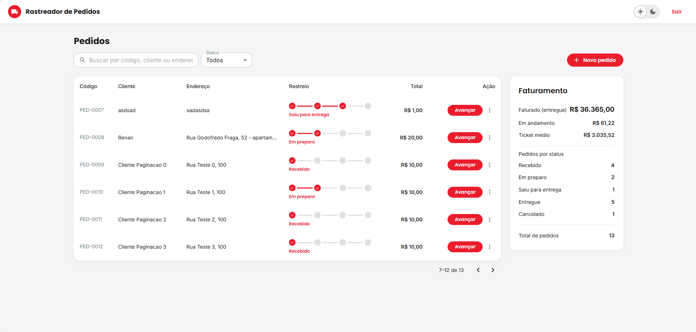

# Rastreador de Pedidos

Sistema de rastreamento de pedidos de delivery: cadastro/login de usuário,
criação de pedidos e acompanhamento do status de entrega, do recebimento até
a entrega.



## Stack

| Camada | Escolha |
|---|---|
| Linguagem | Java 21 |
| Framework | Spring Boot 4.1 |
| Build (back) | Maven (via `mvnw`) |
| Persistência | SQLite + Spring Data JPA (Hibernate) |
| Segurança | Spring Security 7 + JWT |
| Testes (back) | JUnit 5 + Mockito + JaCoCo |
| Front-end | React 19 + TypeScript |
| Build (front) | Vite |
| UI | MUI (Material UI) |
| Requisições HTTP / cache | Axios + TanStack Query |
| Roteamento | React Router |

## Pré-requisitos

- Java 21
- Node.js 20+
- Variável de ambiente `JWT_SECRET` — uma string de pelo menos 32 caracteres,
  usada para assinar os tokens JWT. As variáveis necessárias estão listadas em
  `.env.example` (apenas documentação — não é lido pela aplicação).

## Como rodar

### Backend

PowerShell:

```powershell
$env:JWT_SECRET = "uma-chave-secreta-de-pelo-menos-32-caracteres"
./mvnw spring-boot:run
```

Bash/Linux/macOS:

```bash
export JWT_SECRET="uma-chave-secreta-de-pelo-menos-32-caracteres"
./mvnw spring-boot:run
```

A API sobe em `http://localhost:8080`. Pra não precisar setar a variável a
cada terminal novo, configure-a no `Run/Debug Configuration` da sua IDE
(no IntelliJ: `Environment variables`).

### Frontend

```bash
cd frontend
npm install
npm run dev
```

A aplicação sobe em `http://localhost:5173` e já aponta para
`http://localhost:8080` por padrão. Para apontar para outro endereço, crie um
`frontend/.env` com `VITE_API_URL=http://outro-host:porta`.

## Rodando os testes

```bash
./mvnw test
```

Gera relatório de cobertura em `target/site/jacoco/index.html`.

## Endpoints

**Públicos**

```
POST   /api/auth/register     cadastro de usuário
POST   /api/auth/login        login, devolve o token JWT
```

**Autenticados** (header `Authorization: Bearer <token>`)

```
POST   /api/orders              cria pedido
GET    /api/orders              lista todos os pedidos
GET    /api/orders/{id}         busca pedido por ID
PATCH  /api/orders/{id}/status  atualiza o status do pedido
```

## Máquina de status do pedido

```
RECEBIDO ──────► EM_PREPARO ──────► SAIU_PARA_ENTREGA ──────► ENTREGUE
   │                  │                     │
   └──────────────────┴─────────► CANCELADO ┘
```

`ENTREGUE` e `CANCELADO` são estados terminais — nenhuma transição é permitida
a partir deles.

## Decisões técnicas

- **Organização por feature** (`order/`, `auth/`, `security/`, `common/`) em
  vez de por camada técnica — reduz a navegação entre pastas para entender uma
  funcionalidade completa.
- **Máquina de transição de status no domínio** (`OrderStatus`), não na camada
  de service — mantém a regra de negócio mais importante do projeto isolada e
  testável sem depender de infraestrutura.
- **Autenticação stateless com JWT** em vez de sessão — API sem estado no
  servidor, mais simples de escalar horizontalmente.
- **SQLite** como banco — elimina a necessidade de infraestrutura externa para
  rodar o projeto localmente; a camada de persistência usa Spring Data JPA, o
  que tornaria a troca para outro banco relacional uma mudança de
  configuração, não de código.
- **Busca, filtro e paginação da listagem no front**, sem suporte dedicado no
  back — o volume de pedidos por usuário não justifica paginação no servidor
  agora, e manter essa lógica no front evita uma ida à API a cada tecla
  digitada na busca.
- **Pedidos ordenados pelo estágio** (Recebido → Entregue/Cancelado) em vez de
  por data de criação — prioriza visualmente os pedidos que ainda precisam de
  ação sobre os já finalizados.
- **Drawer lateral para o detalhe do pedido** em vez de uma rota própria —
  evita perder o contexto da lista (filtros, página) ao inspecionar um
  pedido, e mantém as ações de avançar/cancelar no mesmo lugar.
- **Token JWT em `localStorage`** injetado por um interceptor do Axios, com
  logout limpando o cache do TanStack Query — evita que dados da sessão
  anterior vazem para a próxima.
